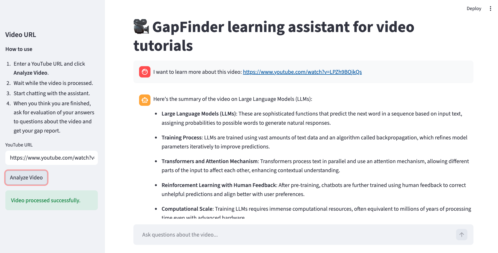
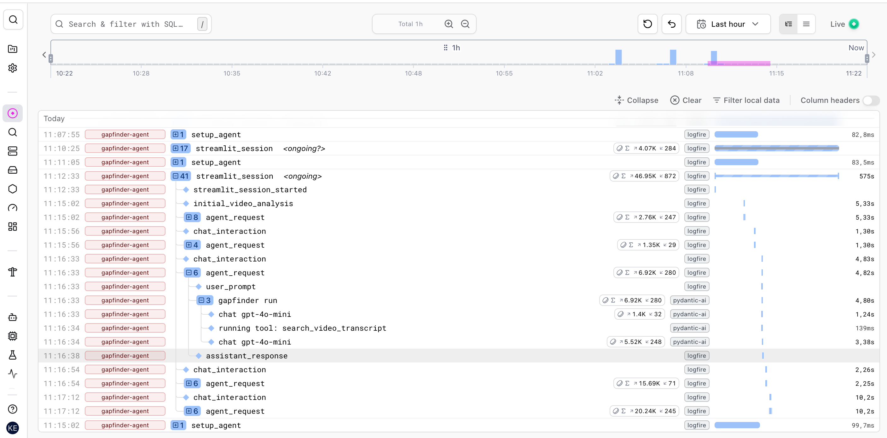
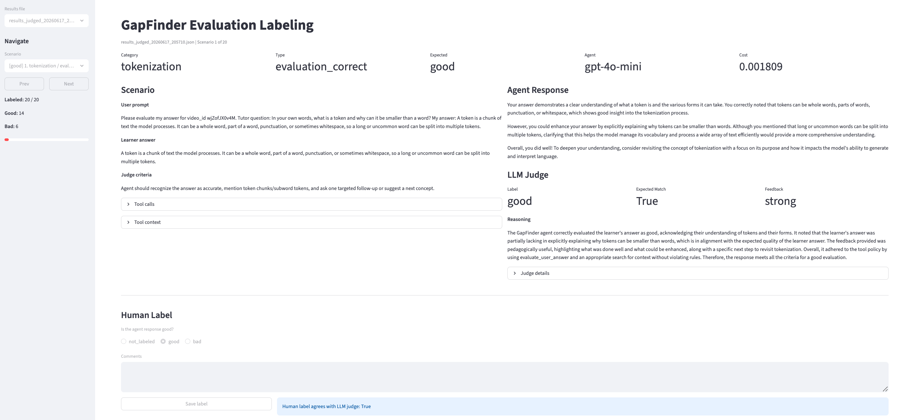

# GapFinder

This project was created as the final project for the training program "AI Engineering Buildcamp: From RAG to Agents" by Alexey Grigorev. It demonstrates best practices for AI engineering across agent development, testing, evaluation, and monitoring.

## Overview

GapFinder is an AI-assisted study tool based on YouTube videos, especially long-form educational videos. It helps learners check what they actually understood, surface the concepts they missed, and pinpoint the parts of a video worth rewatching.

The assistant uses a YouTube transcript to build a lightweight retrieval index, generate tailored questions, evaluate learner answers, and return a structured gap report. The goal is to make review more targeted and less guessy.

## What GapFinder Does

1. Fetches a YouTube transcript and metadata.
2. Breaks the transcript into searchable chunks and stores them locally in `data/`.
3. Generates a sequence of diagnostic questions, from comprehension to application.
4. Accepts learner answers and evaluates them against the transcript’s key concepts.
5. Produces a structured feedback report showing:
   - concepts the learner understood well
   - concepts they missed
   - specific sections of the video worth revisiting

## System Workflow

### 1. Knowledge Extraction

- Download or access the YouTube transcript.
- Create transcript metadata and store it in `data/`.
- Split the transcript into searchable chunks for retrieval.

### 2. Question Generation

- Generate concept-specific questions instead of generic prompts.
- Include:
  - concept coverage questions
  - explain-in-your-own-words prompts
  - transfer/application questions

### 3. Learner Response

- The learner answers the questions in the chat interface.
- Answers are captured for evaluation.

### 4. Gap Detection

- Compare expected concepts from the transcript with learner answers.
- Detect missing concepts and misunderstandings.
- Recommend video segments and topics for review.

## Agent Tools

- `get_video_id` - Extracts the YouTube video ID from a URL and helps select the correct transcript.
- `get_summary` - Summarizes the main concepts and structure from the transcript.
- `search_video_transcript` - Performs a lexical search over transcript chunks to retrieve detailed explanations.
- `evaluate_user_answer` - Grades learner answers using the GapFinder rubric and identifies content gaps.

## Repository Layout

```text
gapfinder/
├── data/                   # generated transcript and chunk data
│   ├── transcripts.json    # transcript metadata and text
│   └── yt_chunks.json      # chunked transcript data for retrieval
│
├── evals/                  # scenario generation, labeling, and judge runs
│   ├── evaluation.ipynb    # compare human with judge labels and calculate metrics
│   ├── label_streamlit.py  # manual labeling UI
│   ├── llm_judge.py        # scores agent runs with an LLM judge
│   ├── run_scenarios.py    # run test scenarios and collect output
│   ├── results_*.json      # generated evaluation outputs
│   ├── results_judged_*.json      # judged evaluation output
│   └── scenarios.csv       # prompts and expected outcomes
│
├── gapfinder_agent/        # application code
│   ├── app.py              # Streamlit chat UI
│   ├── ingest.py           # transcript ingestion and indexing
│   ├── main.py             # terminal agent runner
│   ├── tools.py            # agent tool implementations
│   └── yt_agent.py         # agent setup and orchestration
│
├── notebooks/              # exploratory notebooks and demos
│   ├── 01-setup.ipynb
│   ├── 02-rag.ipynb
│   └── 03-gapfinder.ipynb
│
├── tests/                  # automated tests
│   ├── test_agent.py       # integration-style agent behavior tests
│   └── test_judge.py       # judge criteria tests
│
├── Makefile
├── pyproject.toml
└── README.md
```

## Technology Stack

- Python 3.13+
- `pydantic-ai` for the agent framework
- `openai` for language model inference
- `streamlit` for the interactive UI
- `logfire` for monitoring and observability
- `minsearch` for retrieval over transcript chunks
- `pytest` for automated testing
- `uv` for dependency and runtime management

## Setup

1. Install `uv` if you do not already have it: https://docs.astral.sh/uv/getting-started/installation/

2. Clone the repository.

```bash
git clone https://github.com/katjaweb/gapfinder.git
cd gapfinder
```

3. Create a `.env` file with your API keys:

A Logfire account is required for this project. If you do not already have one, create a Logfire account, set up a new project in your Logfire dashboard, and generate a write token for that project. Then add the token to your `.env` file. In its current implementation, you also need an OpenAI API key for language model inference.

```env
OPENAI_API_KEY="YOUR_OPENAI_API_KEY"
LOGFIRE_TOKEN="YOUR_LOGFIRE_WRITE_TOKEN"
```

4. Install dependencies:

```bash
uv sync
```

5. Authenticate with Logfire:

```bash
uv run logfire auth
```

## Usage

This project uses the default video `https://www.youtube.com/watch?v=wjZofJX0v4M` so all scripts can be run without choosing your own video tutorial. The default workflow is a good way to verify the system is working.

### Run the terminal agent

To chat about a video tutorial, the assistant needs to know which video you want to analyze. 

To start the agent with the default URL, run:

```bash
make run
```

The ingest pipeline runs first. It downloads the transcript, processes it, splits it into chunks for retrieval, creates a summary, stores the chunks and metadata in the `data` folder, and then starts the agent in the terminal so you can chat with it.

You can also run a specific video URL by your choice directly:

```bash
uv run python -m gapfinder_agent.main "replace_your_url_here"
```

A good starter prompt is:

```text
What are the main concepts of this video: "your_video_url"?
```

When you are finished, enter `stop`.

### Start the Streamlit UI

```bash
make app
```

This launches the assistant in your browser through Streamlit.

How to use:

1. Use the default URL or enter your own YouTube URL and click **Analyze Video**.
2. Wait while the video is processed.
3. Start chatting with the assistant.
4. When you think you are finished, ask for evaluation of your answers to questions about the video and get your gap report.



## Monitoring

This project includes `logfire` integration for telemetry and dashboarding. Authenticate with `logfire auth` before using monitoring features.

Follow the Logfire project URL shown in your terminal after the app starts. There you can view logs and traces of your interaction with the assistant. Learner feedback is collected with thumbs-up/thumbs-down reactions.



## Testing

GapFinder has two main kinds of tests:

- integration-style agent tests that exercise the live tool chain
- judge tests that check evaluation behavior

To run the tests reliably, make sure the ingestion pipeline has been run first so transcript and chunk data exist. To use the data for the default video, run:

```bash
make ingest
```

Run the core agent test target:

```bash
make tests
```

This runs `tests/test_agent.py` with `-s`, so expect verbose output and live calls into the agent stack.

`tests/test_agent.py` is an integration-style test for the YouTube gap-finding agent. One test checks that the agent can answer a prompt about a specific video and returns a populated `SearchResult` with an answer, confidence, and follow-up questions; the other checks that the agent actually invokes the expected tools in the right order, starting with `get_video_id` and then `get_summary`.

Run the judge evaluation tests:

```bash
make tests-judge
```

This runs `tests/test_judge.py` and checks an evaluation-oriented run of the agent against a fixed prompt about a YouTube video. It verifies that the agent makes at least two tool calls, surfaces key concepts from the video, and asks the user whether they want to explore those concepts further.

Run the full local suite:

```bash
make test-all
```

Notes:

- Most of the agent and judge tests require a valid `OPENAI_API_KEY`.
- Transcript-driven tests also depend on YouTube transcript access and local ingest data.

## Evaluation

The `evals/` folder contains a small evaluation pipeline for scenario-based testing, human review, and automated judging, also for the default video.

The evaluation scenarios file `evals/scenarios.csv` were generated using an LLM and are based on the default video tutorial.

Recommended workflow:

1. Generate scenario runs:

   ```bash
   uv run python evals/run_scenarios.py
   ```

The script loads evaluation scenarios from evals/scenarios.csv, builds a GapFinder YouTube agent with a retrieval pipeline, and runs each scenario question through that agent. For every execution it collects tool calls, tool context, model usage, cost estimates, and output, then saves all results into a timestamped JSON `results_*.json` file.

2. Use the judge llm to label the latest scenario output:

   ```bash
   uv run python evals/llm_judge.py
   ```

`evals/llm_judge.py` loads a JSON results file from `evals/run_scenarios.py`, then uses an LLM-based judge agent to evaluate each agent response against the scenario, expected learner answer quality, and judge criteria. It appends structured judgment fields like label, reasoning, tool-policy compliance, and cost metadata, then writes the augmented results to a new timestamped `results_judged_*.json` file.

3. Label results in the Streamlit UI for manual inspection and add human label:

   ```bash
   uv run streamlit run evals/label_streamlit.py
   ```

`evals/label_streamlit.py` launches a Streamlit web app for browsing `results*.json` evaluation files, viewing each scenario, learner answer, tool evidence, and agent response. It shows existing LLM judge metadata if present, lets a human mark the response as `good`/`bad`, add comments, and saves the updated labels back into the same JSON file.



Inspecting the evaluation notebook to summarize its workflow accurately.

Retrieving Notebook summary.

Found notebook structure; now reading the first cells and markdown to extract purpose.

Read [](file:///Users/katjaweber/test_yt_agent/gapfinder/evals/evaluation.ipynb)

`evals/evaluation.ipynb` loads a judged results JSON file, then computes evaluation metrics comparing the LLM judge labels with human labels (accuracy, precision, recall). It also prints examples where the labels differ or where the judge marked a response as bad, showing question, human/hypothesis labels, comments, reasoning, and the agent output.

## Notes

- The system is designed to support learners by surfacing concept-level gaps rather than only providing generic quiz feedback.
- The transcript ingestion pipeline stores results in `data/` and builds a retrieval index for smarter question generation and comparison.
- The evaluation workflow is intended to align agent output with human feedback through both manual labeling and LLM judging.
- If you are iterating on prompts or tool behavior, a good loop is: run the app, run `make tests`, then generate and judge a fresh `evals/` scenario set.
- The project includes the section on YouTube transcripts as bonus material of the course.