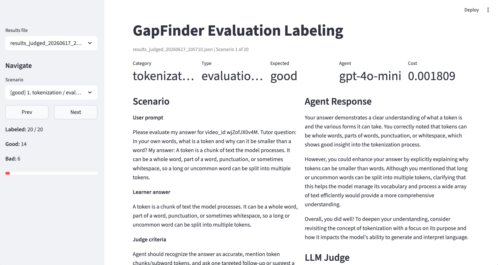

# GapFinder

This project was created as the final project for the training program "AI Engineering Buildcamp: From RAG to Agents" by Alexey Grigorev. It demonstrates best practices for AI engineering across agent development, testing, evaluation, and monitoring.

## Overview

GapFinder is an AI-assisted study tool based on YouTube videos, especially long-form educational videos. It helps learners check what they actually understood, surface the concepts they missed, and pinpoint the parts of a video worth rewatching.

The assistant uses a YouTube transcript to build a lightweight retrieval index, generate tailored questions, evaluate learner answers, and return a structured gap report. The goal is to make review more targeted and less guessy.

## What GapFinder Does

1. Fetches a YouTube transcript and metadata.
2. Breaks the transcript into searchable chunks and stores them locally in `data/`.
3. Generates a sequence of diagnostic questions, from comprehension to application.
4. Accepts learner answers and evaluates them against the transcript’s key concepts.
5. Produces a structured feedback report showing:
   - concepts the learner understood well
   - concepts they missed
   - specific sections of the video worth revisiting

## System Workflow

### 1. Knowledge Extraction

- Download or access the YouTube transcript.
- Create transcript metadata and store it in `data/`.
- Split the transcript into searchable chunks for retrieval.

### 2. Question Generation

- Generate concept-specific questions instead of generic prompts.
- Include:
  - concept coverage questions
  - explain-in-your-own-words prompts
  - transfer/application questions

### 3. Learner Response

- The learner answers the questions in the chat interface.
- Answers are captured for evaluation.

### 4. Gap Detection

- Compare expected concepts from the transcript with learner answers.
- Detect missing concepts and misunderstandings.
- Recommend video segments and topics for review.

## Agent Tools

- `get_video_id` - Extracts the YouTube video ID from a URL and helps select the correct transcript.
- `get_summary` - Summarizes the main concepts and structure from the transcript.
- `search_video_transcript` - Performs a lexical search over transcript chunks to retrieve detailed explanations.
- `evaluate_user_answer` - Grades learner answers using the GapFinder rubric and identifies content gaps.

## Repository Layout

```text
gapfinder/
├── data/                   # generated transcript and chunk data
│   ├── transcripts.json    # transcript metadata and text
│   └── yt_chunks.json      # chunked transcript data for retrieval
│
├── evals/                  # scenario generation, labeling, and judge runs
│   ├── evaluation.ipynb    # compare human with judge labels and calculate metrics
│   ├── label_streamlit.py  # manual labeling UI
│   ├── llm_judge.py        # scores agent runs with an LLM judge
│   ├── run_scenarios.py    # run test scenarios and collect output
│   ├── results_*.json      # generated evaluation outputs
│   ├── results_judged_*.json      # judged evaluation output
│   └── scenarios.csv       # prompts and expected outcomes
│
├── gapfinder_agent/        # application code
│   ├── app.py              # Streamlit chat UI
│   ├── ingest.py           # transcript ingestion and indexing
│   ├── main.py             # terminal agent runner
│   ├── tools.py            # agent tool implementations
│   └── yt_agent.py         # agent setup and orchestration
│
├── notebooks/              # exploratory notebooks and demos
│   ├── 01-setup.ipynb
│   ├── 02-rag.ipynb
│   └── 03-gapfinder.ipynb
│
├── tests/                  # automated tests
│   ├── test_agent.py       # integration-style agent behavior tests
│   ├── test_judge.py       # judge criteria tests
│   └── test_tool_limits.py # tool-limit regression test
│
├── Makefile
├── pyproject.toml
└── README.md
```

## Technology Stack

- Python 3.13+
- `pydantic-ai` for the agent framework
- `openai` for language model inference
- `streamlit` for the interactive UI
- `logfire` for monitoring and observability
- `minsearch` for retrieval over transcript chunks
- `pytest` for automated testing
- `uv` for dependency and runtime management

## Setup

1. Install `uv` if you do not already have it: https://docs.astral.sh/uv/getting-started/installation/

2. Clone the repository.

3. Create a `.env` file with your API keys:

```env
OPENAI_API_KEY="YOUR_OPENAI_API_KEY"
LOGFIRE_TOKEN="YOUR_LOGFIRE_TOKEN"
```

4. Install dependencies:

```bash
uv sync
```

5. Authenticate with Logfire:

```bash
uv run logfire auth
```

## Usage

### Run the terminal agent

```bash
make run
```

This starts the agent in the terminal so you can interact with it by chat.

You can also run a specific video URL directly:

```bash
uv run python -m gapfinder_agent.main "replace_your_url_here"
```

A good starter prompt is:

```text
What are the main concepts of this video: "your_video_url"?
```

When you are finished, enter `stop`.

### Start the Streamlit UI

```bash
make app
```

This launches the assistant in your browser through Streamlit.

How to use:

1. Enter a YouTube URL and click **Analyze Video**.
2. Wait while the video is processed.
3. Start chatting with the assistant.
4. When you think you are finished, ask for evaluation of your answers to questions about the video and get your gap report.


## Monitoring

This project includes `logfire` integration for telemetry and dashboarding. Authenticate with `logfire auth` before using monitoring features.

Follow the Logfire project URL shown in your terminal after the app starts. There you can view logs and traces of your interaction with the assistant. Learner feedback is collected with thumbs-up/thumbs-down reactions.


## Testing

GapFinder has two main kinds of tests:

- integration-style agent tests that exercise the live tool chain
- judge tests that check evaluation behavior

The test scenarios are based on the default video in this project. To run them reliably, make sure the ingestion pipeline has been run first so the transcript and chunk data for the default video exist:

```bash
make ingest
```

Run the core agent test target:

```bash
make tests
```

This runs `tests/test_agent.py` with `-s`, so expect verbose output and live calls into the agent stack.

Run the judge evaluation tests:

```bash
make tests-judge
```

This runs `tests/test_judge.py` with `pytest-xdist` and is useful for checking the explicit evaluation flow.

Run the full local suite:

```bash
make test-all
```

Notes:

- Most of the agent and judge tests require a valid `OPENAI_API_KEY`.
- Transcript-driven tests also depend on YouTube transcript access and local ingest data.

## Evaluation

The `evals/` folder contains a small evaluation pipeline for scenario-based testing, human review, and automated judging.

Recommended workflow:

1. Generate scenario runs:

   ```bash
   uv run python evals/run_scenarios.py
   ```

2. Use the judge llm to label the latest scenario output:

   ```bash
   uv run python evals/llm_judge.py
   ```

3. Label results in the Streamlit UI for manual inspection and add human label:

   ```bash
   uv run streamlit run evals/label_streamlit.py
   ```



What the evaluation checks:

- whether the agent chooses the right tools for the situation
- whether it answers in the right mode, especially when the user explicitly asks for evaluation
- whether it gives grounded, pedagogically useful feedback
- whether it stays aligned with the learner answer quality expected by each scenario

The generated artifacts are written back into `evals/` as timestamped `results_*.json` and `results_judged_*.json` files.

## Notes

- The system is designed to support learners by surfacing concept-level gaps rather than only providing generic quiz feedback.
- The transcript ingestion pipeline stores results in `data/` and builds a retrieval index for smarter question generation and comparison.
- The evaluation workflow is intended to align agent output with human feedback through both manual labeling and LLM judging.
- If you are iterating on prompts or tool behavior, a good loop is: run the app, run `make tests`, then generate and judge a fresh `evals/` scenario set.
- The project includes the section on YouTube transcripts as bonus material.
